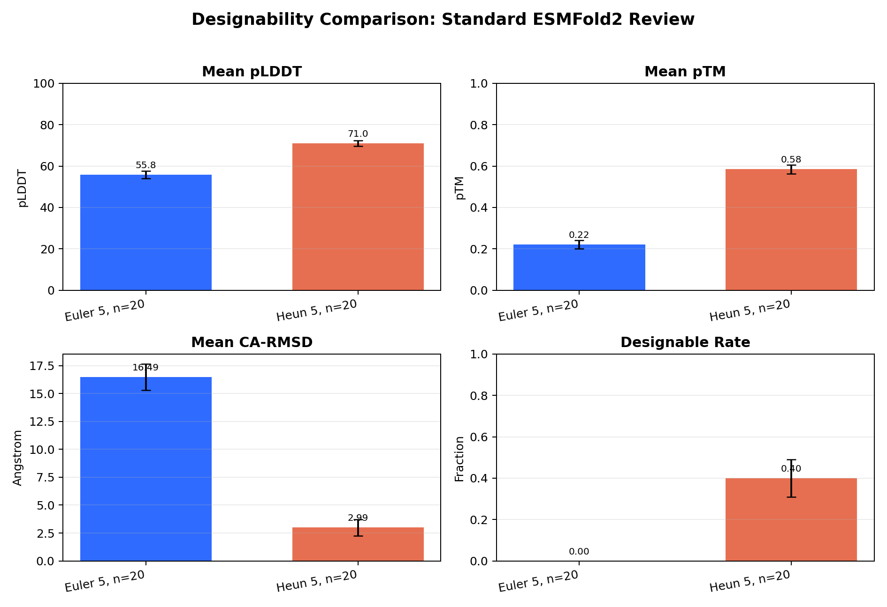
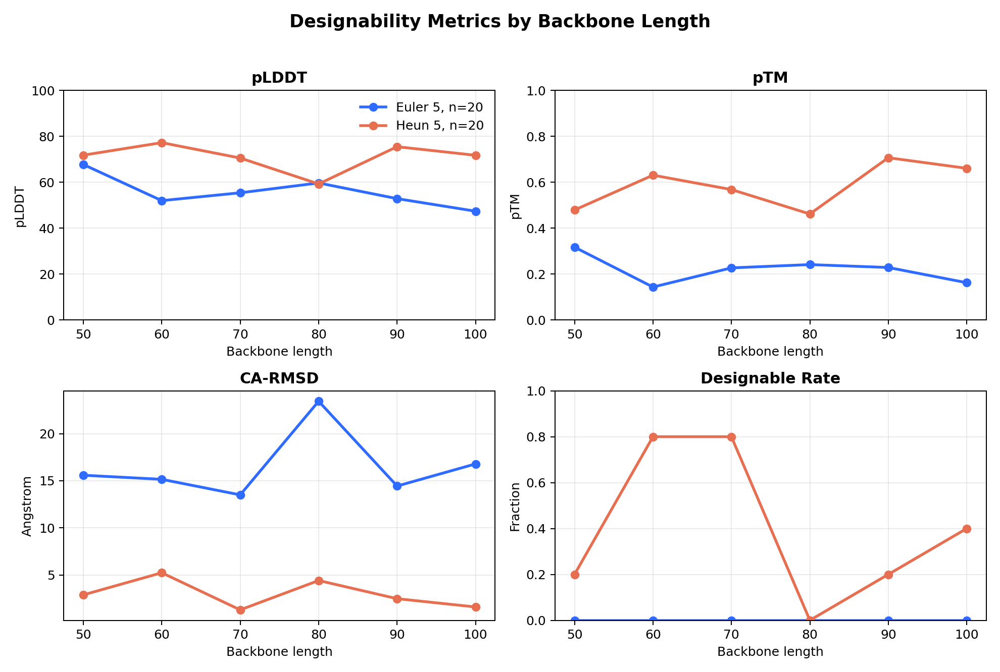
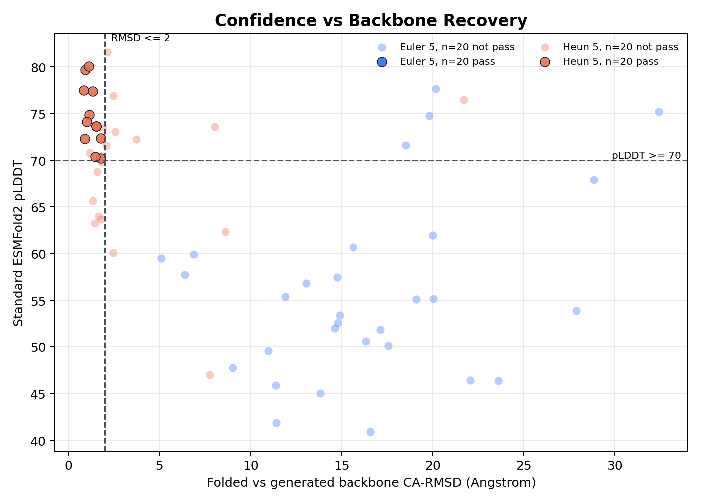
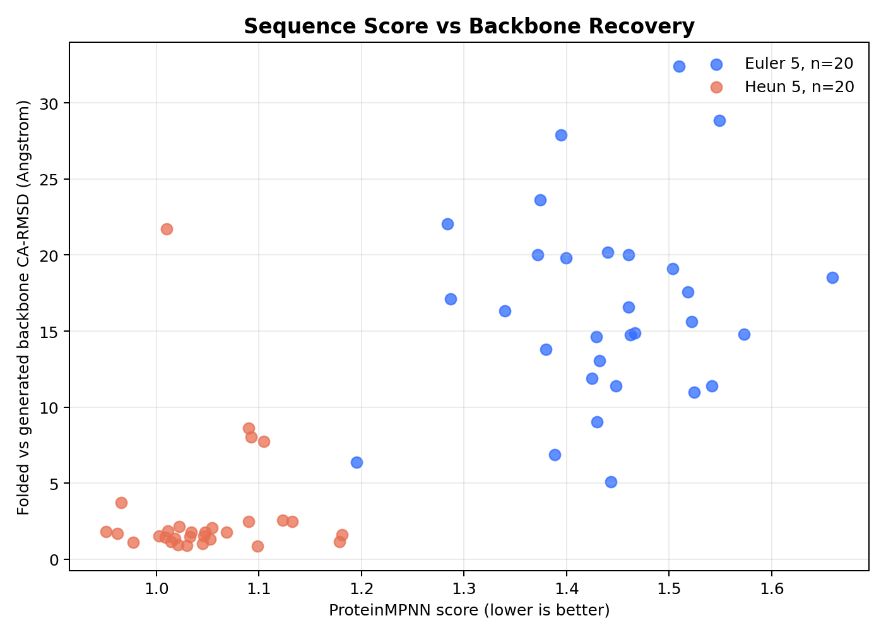
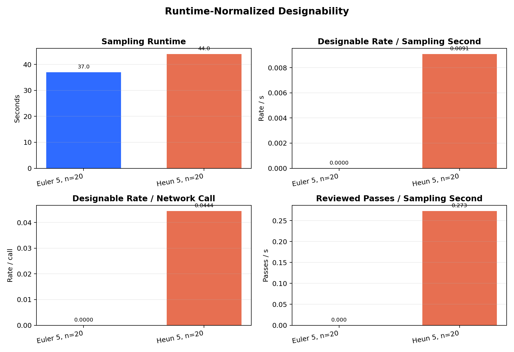

# Protein FrameFlow SE(3) Sampler Benchmark

本项目基于 Microsoft FrameFlow / FoldFlow 的蛋白质骨架生成代码，研究在不重新训练模型权重的前提下，替换或增强 SE(3) flow 推理阶段采样器对短步数生成质量和可设计性的影响。

重点比较：

- `Euler`：一阶 baseline。
- `Heun / RK2`：二阶 predictor-corrector 采样器。
- `Lie-AB2`：历史向量场复用的多步采样器。
- 后处理验证：`ProteinMPNN` 序列设计 + `ESMFold2` 结构回折。

> 本仓库不包含 FrameFlow 权重、训练数据集、ProteinMPNN 权重、ESMFold2 权重、Hugging Face 缓存或大规模生成的 PDB/CIF/FASTA 结果。

## 目录

- [环境配置](#环境配置)
- [FrameFlow 骨架采样](#frameflow-骨架采样)
- [几何质量评估](#几何质量评估)
- [质量-效率 Benchmark](#质量-效率-benchmark)
- [ProteinMPNN 与 ESMFold2 可设计性验证](#proteinmpnn-与-esmfold2-可设计性验证)
- [结果展示](#结果展示)
- [当前结论](#当前结论)

## 环境配置

原始 FrameFlow 推荐环境为 Python 3.10 + CUDA 11.7。本项目推理实验使用 Python 3.12 / CUDA 12.4 / PyTorch 2.5.1，并提供适配依赖：

```bash
cd protein-frame-flow-main
pip install -r requirements-inference.txt
```

关键依赖包括：

```text
torch-scatter
hydra-core
omegaconf
pytorch-lightning
numpy / pandas / scipy
biopython
mdtraj
tmtools
matplotlib
```

FrameFlow 权重需用户自行下载并放置到：

```text
weights/pdb/published.ckpt
weights/pdb/config.yaml
```

## FrameFlow 骨架采样

采样配置位于：

```text
configs/inference_unconditional.yaml
```

采样器通过 Hydra 参数控制：

```text
inference.interpolant.sampling.method = euler | heun | ab2
inference.interpolant.sampling.num_timesteps = 5 | 10 | 20 | 50 | 100
```

示例：运行 5-step Euler。

```bash
python -W ignore experiments/inference_se3_flows.py \
  -cn inference_unconditional \
  inference.num_gpus=1 \
  'inference.interpolant.sampling.method=euler' \
  'inference.interpolant.sampling.num_timesteps=5' \
  'inference.samples.length_subset=[50,60,70,80,90,100]' \
  inference.samples.samples_per_length=20 \
  inference.inference_subdir=euler_5_n20
```

示例：运行 5-step Heun。

```bash
python -W ignore experiments/inference_se3_flows.py \
  -cn inference_unconditional \
  inference.num_gpus=1 \
  'inference.interpolant.sampling.method=heun' \
  'inference.interpolant.sampling.num_timesteps=5' \
  'inference.samples.length_subset=[50,60,70,80,90,100]' \
  inference.samples.samples_per_length=20 \
  inference.inference_subdir=heun_5_n20
```

输出结构：

```text
inference_outputs/weights/pdb/published/unconditional/euler_5_n20/
  length_50/sample_0/sample.pdb
  length_50/sample_0/bb_traj.pdb
  length_50/sample_0/x0_traj.pdb
```

其中 `sample.pdb` 是最终生成骨架，后续几何评估、ProteinMPNN 序列设计和 ESMFold2 回折都基于该文件。

## 几何质量评估

批量计算所有 `sample.pdb` 的几何指标：

```bash
python analysis/evaluate_samples.py \
  --root inference_outputs/weights/pdb/published/unconditional/euler_5_n20 \
  --out inference_outputs/weights/pdb/published/unconditional/euler_5_n20/metrics.csv
```

主要指标：

- `ca_ca_deviation`：连续 CA-CA 距离相对理想值的平均偏差。
- `ca_ca_valid_percent`：连续 CA-CA 距离落在合理范围内的比例。
- `ca_ca_bad_percent`：异常 CA-CA 键长比例。
- `radius_of_gyration`：回转半径。
- `helix_percent / strand_percent / coil_percent`：二级结构比例。

## 质量-效率 Benchmark

项目提供批量 benchmark 脚本：

```bash
SAMPLES_PER_LENGTH=20 \
TIMESTEPS="5 10 20 50 100" \
LENGTH_SUBSET="[50,60,70,80,90,100]" \
bash scripts/run_quality_efficiency_benchmark.sh
```

默认比较：

```text
euler_5/10/20/50/100_n20
heun_5/10/20/50/100_n20
ab2_5/10/20/50/100_n20
```

每个配置：

```text
6 lengths * 20 samples = 120 backbones
```

每个输出目录包含：

```text
metrics.csv
runtime_seconds.txt
```

汇总绘图：

```bash
python analysis/plot_quality_efficiency.py \
  --root inference_outputs/weights/pdb/published/unconditional \
  --tag n20 \
  --out-dir inference_outputs/weights/pdb/published/unconditional/quality_efficiency_n20 \
  --x runtime
```

## ProteinMPNN 与 ESMFold2 可设计性验证

可设计性验证流程：

```text
FrameFlow sample.pdb
  -> ProteinMPNN 设计序列
  -> 每个骨架取 top ProteinMPNN sequences
  -> ESMFold2-Fast 全量初筛
  -> 每个 sampler / length 选 top candidates
  -> 标准 ESMFold2 复核
  -> 计算 pLDDT / pTM / CA-RMSD / TM-score / designable rate
```

### 1. ProteinMPNN 序列设计

ProteinMPNN 需单独准备：

```bash
git clone https://github.com/dauparas/ProteinMPNN.git /root/autodl-tmp/protein-frame-flow-main/ProteinMPNN
```

对 Euler 5-step 结果设计序列：

```bash
python scripts/run_proteinmpnn_on_samples.py \
  --root inference_outputs/weights/pdb/published/unconditional/euler_5_n20 \
  --proteinmpnn-dir /root/autodl-tmp/protein-frame-flow-main/ProteinMPNN \
  --out inference_outputs/weights/pdb/published/unconditional/euler_5_n20/proteinmpnn \
  --num-seq-per-target 8 \
  --sampling-temp "0.1 0.2" \
  --batch-size 1
```

Heun 5-step 同理，将 `euler_5_n20` 改为 `heun_5_n20`。

### 2. 汇总 top ProteinMPNN 序列

每个骨架取 ProteinMPNN score 最低的 top 3：

```bash
python scripts/collect_top_mpnn_sequences.py \
  --manifest inference_outputs/weights/pdb/published/unconditional/euler_5_n20/proteinmpnn/proteinmpnn_manifest.csv \
  --manifest inference_outputs/weights/pdb/published/unconditional/heun_5_n20/proteinmpnn/proteinmpnn_manifest.csv \
  --top-k 3 \
  --out-fasta inference_outputs/weights/pdb/published/unconditional/designability_top3.fasta \
  --out-csv inference_outputs/weights/pdb/published/unconditional/designability_top3.csv
```

规模：

```text
2 samplers * 6 lengths * 20 backbones * 3 sequences = 720 sequences
```

### 3. ESMFold2-Fast 初筛

ESMFold2-Fast 用于高通量初筛：

```bash
python scripts/run_esmfold2_batch.py \
  --fasta inference_outputs/weights/pdb/published/unconditional/designability_top3.fasta \
  --out-dir inference_outputs/weights/pdb/published/unconditional/esmfold2_fast_top3 \
  --model-name /root/autodl-tmp/hf_models/biohub_ESMFold2_Fast \
  --device cuda \
  --num-loops 3 \
  --num-sampling-steps 32 \
  --num-diffusion-samples 1 \
  --seed 0
```

### 4. 标准 ESMFold2 复核

每个 `sampler / length` 分组保留 top 20 候选：

```bash
python scripts/select_esmfold2_candidates.py \
  --design-csv inference_outputs/weights/pdb/published/unconditional/designability_top3.csv \
  --fast-csv inference_outputs/weights/pdb/published/unconditional/esmfold2_fast_top3/esmfold2_results.csv \
  --top-per-group 20 \
  --out-fasta inference_outputs/weights/pdb/published/unconditional/standard_review_top20.fasta \
  --out-csv inference_outputs/weights/pdb/published/unconditional/standard_review_top20.csv
```

标准版复核规模：

```text
2 samplers * 6 lengths * 20 candidates = 240 sequences
```

运行标准 ESMFold2：

```bash
python scripts/run_esmfold2_batch.py \
  --fasta inference_outputs/weights/pdb/published/unconditional/standard_review_top20.fasta \
  --out-dir inference_outputs/weights/pdb/published/unconditional/esmfold2_standard_top20 \
  --model-name /root/autodl-tmp/hf_models/biohub_ESMFold2 \
  --device cuda \
  --num-loops 3 \
  --num-sampling-steps 32 \
  --num-diffusion-samples 1 \
  --seed 0
```

### 5. 可设计性分析与绘图

严格判定标准：

```text
pLDDT >= 70
pTM >= 0.5
CA-RMSD <= 2.0 Angstrom
```

```bash
python scripts/analyze_designability.py \
  --selection-csv inference_outputs/weights/pdb/published/unconditional/standard_review_top20.csv \
  --fold-csv inference_outputs/weights/pdb/published/unconditional/esmfold2_standard_top20/esmfold2_results.csv \
  --out-designs inference_outputs/weights/pdb/published/unconditional/designability_standard_top20_designs.csv \
  --out-summary inference_outputs/weights/pdb/published/unconditional/designability_standard_top20_summary.csv \
  --min-plddt 70 \
  --min-ptm 0.5 \
  --max-ca-rmsd 2.0
```

宽松判定标准：

```text
pLDDT >= 55
pTM >= 0.15
CA-RMSD <= 10.0 Angstrom
```

```bash
python scripts/analyze_designability.py \
  --selection-csv inference_outputs/weights/pdb/published/unconditional/standard_review_top20.csv \
  --fold-csv inference_outputs/weights/pdb/published/unconditional/esmfold2_standard_top20/esmfold2_results.csv \
  --out-designs inference_outputs/weights/pdb/published/unconditional/designability_relaxed_top20_designs.csv \
  --out-summary inference_outputs/weights/pdb/published/unconditional/designability_relaxed_top20_summary.csv \
  --min-plddt 55 \
  --min-ptm 0.15 \
  --max-ca-rmsd 10.0
```

绘制图表：

```bash
python scripts/plot_designability.py \
  --designs-csv inference_outputs/weights/pdb/published/unconditional/designability_standard_top20_designs.csv \
  --out-dir inference_outputs/weights/pdb/published/unconditional/figures/designability \
  --runtime-root inference_outputs/weights/pdb/published/unconditional \
  --min-plddt 70 \
  --min-ptm 0.5 \
  --max-ca-rmsd 2.0
```

宽松标准只需替换 `--designs-csv`、`--out-dir` 和阈值。

## 结果展示

### 质量-效率结果


### 严格可设计性标准











### 宽松可设计性标准


## 当前结论

- 5-step 极低步数下，Heun/RK2 明显改善 Euler 的 CA-CA 几何退化。
- Heun 需要更多网络调用，运行时间略高于 Euler，但低步数下可设计性显著更好。
- Euler 在严格可设计性标准下通过率很低或为零；在 relaxed 标准下可保留少量候选，但整体仍弱于 Heun。
- Lie-AB2 保持低网络调用次数，但 5-step 下简单历史外推不稳定，目前更适合作为多步历史复用方向的消融实验。
- 当前推荐：若目标是极低步数下的骨架质量和可设计性，优先使用 endpoint-corrected Heun/RK2；若允许 10 步以上，Euler 仍是强 practical baseline。

## 文件上传建议

建议提交到 GitHub：

```text
README.md
scripts/run_proteinmpnn_on_samples.py
scripts/collect_top_mpnn_sequences.py
scripts/run_esmfold2_batch.py
scripts/select_esmfold2_candidates.py
scripts/analyze_designability.py
scripts/plot_designability.py
figures/
```

不建议提交：

```text
ProteinMPNN/
hf_models/
huggingface_cache/
weights/
processed_pdb/
processed_scope/
inference_outputs/
*.pdb
*.cif
*.mmcif
*.safetensors
*.ckpt
```

## 致谢

本项目基于 FrameFlow 官方代码与预训练权重进行推理端采样器实验。原始 FrameFlow 方法来自 SE(3) flow matching 在蛋白质骨架生成和 motif scaffolding 上的工作。
