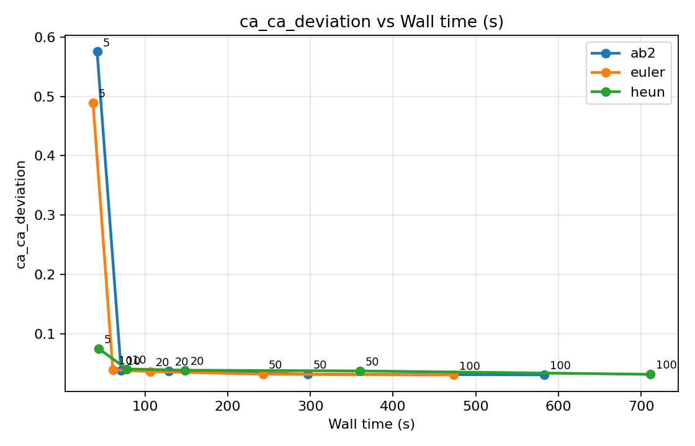
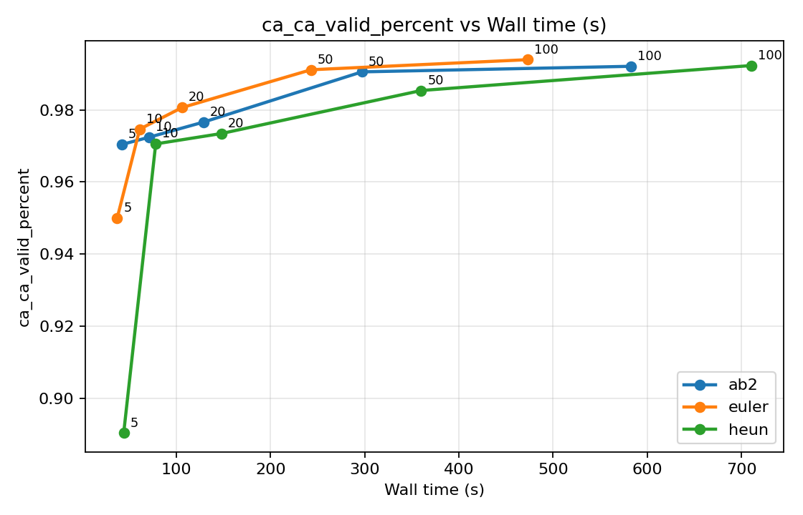
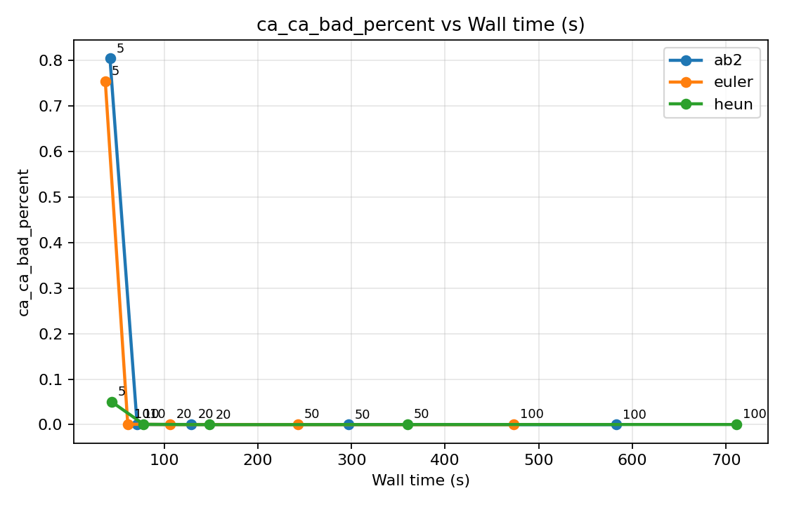
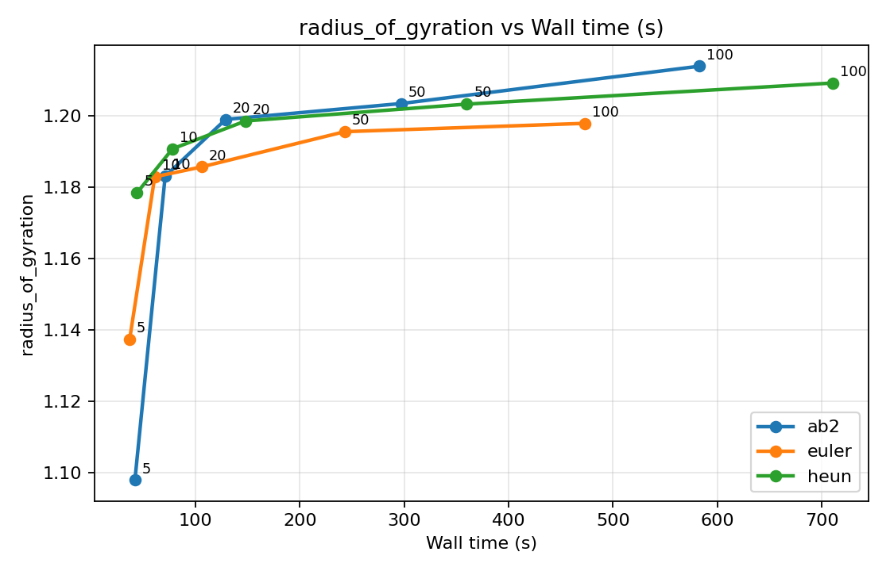
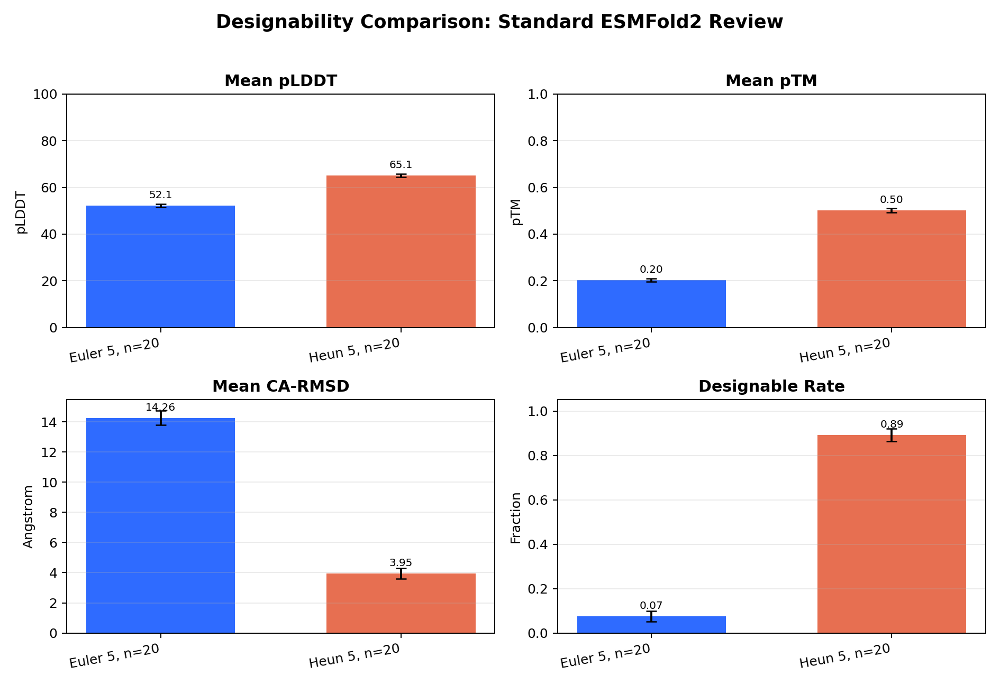
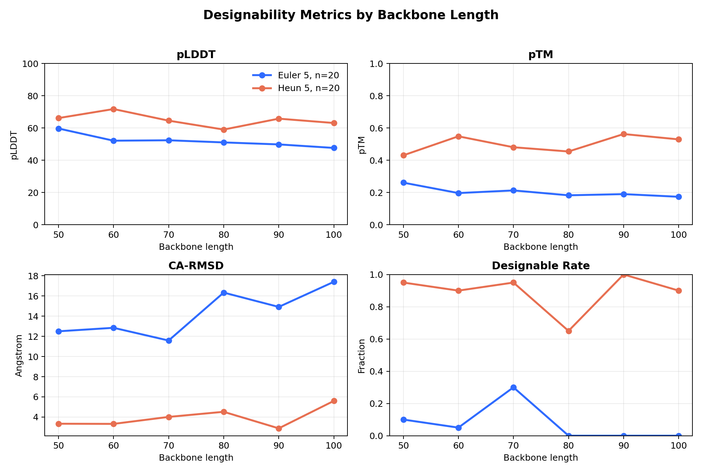
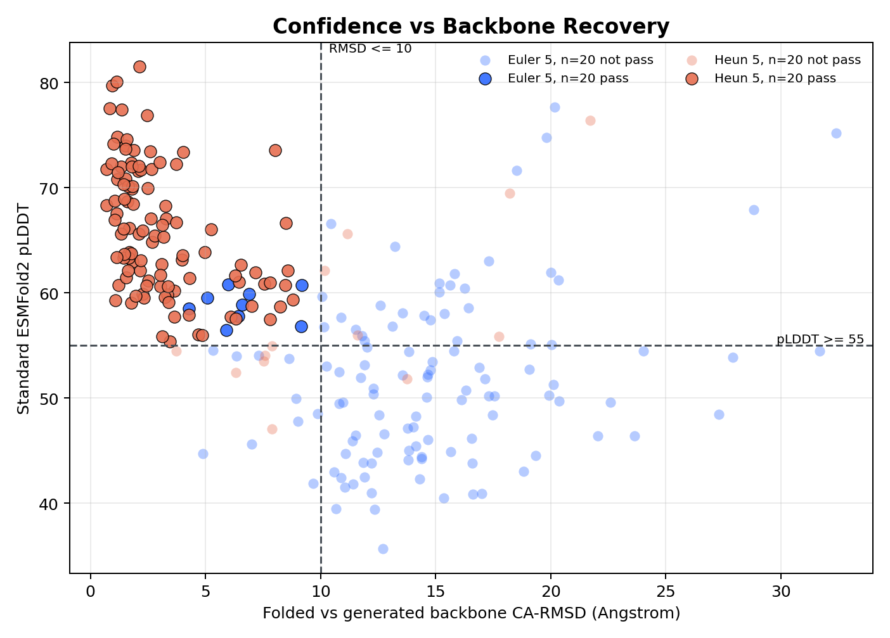
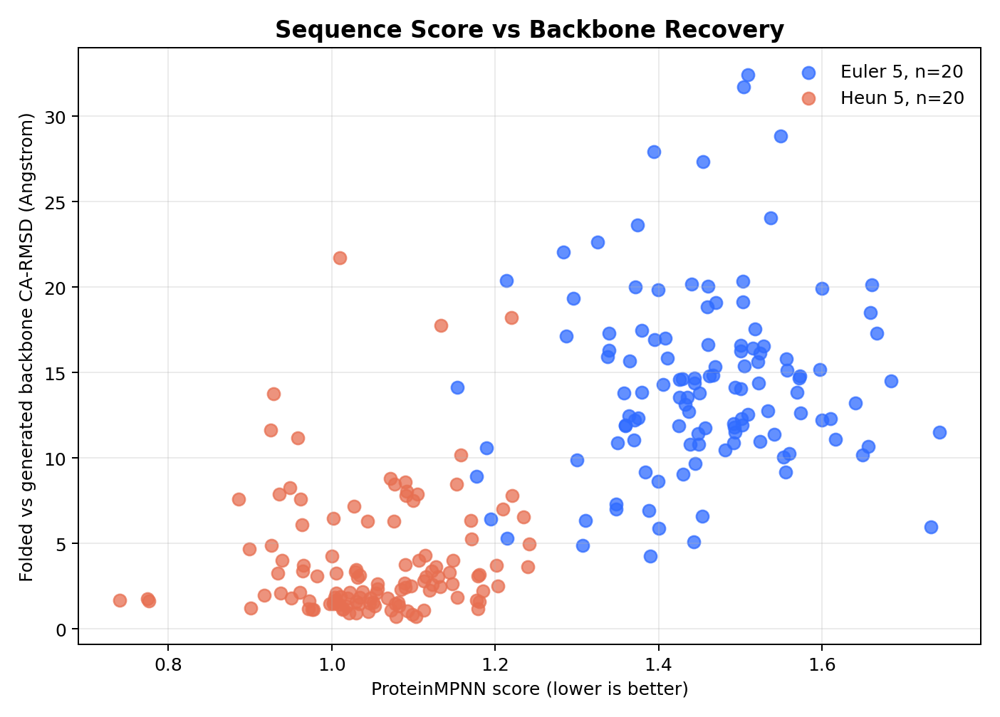
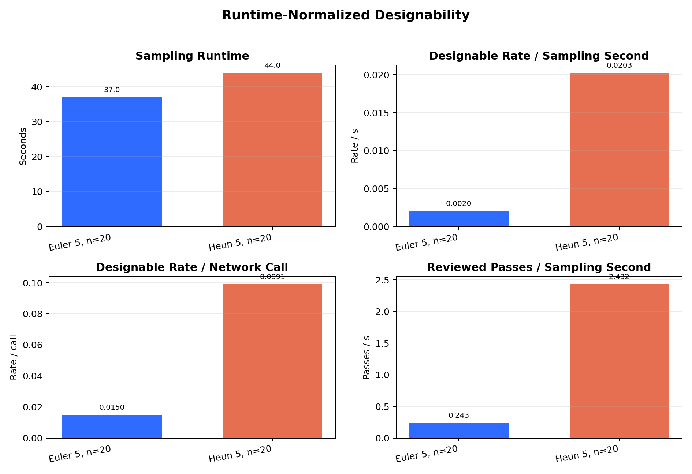

# Protein FrameFlow SE(3) Sampler Benchmark

This project is based on the Microsoft FrameFlow / FoldFlow protein backbone generation codebase. It studies whether inference-time SE(3) flow samplers can be replaced or improved without retraining model weights, with a focus on short-step generation quality and downstream designability.

The main comparisons are:

- `Euler`: first-order baseline sampler.
- `Heun / RK2`: second-order predictor-corrector sampler.
- `Lie-AB2`: multistep sampler using historical vector-field reuse.
- Post-processing validation: `ProteinMPNN` sequence design + `ESMFold2` structure refolding.

> This repository does not include FrameFlow weights, training datasets, ProteinMPNN weights, ESMFold2 weights, Hugging Face caches, or large generated PDB/CIF/FASTA result files.

## Contents

- [Environment](#environment)
- [FrameFlow Backbone Sampling](#frameflow-backbone-sampling)
- [Geometry Evaluation](#geometry-evaluation)
- [Quality-Efficiency Benchmark](#quality-efficiency-benchmark)
- [ProteinMPNN and ESMFold2 Designability Validation](#proteinmpnn-and-esmfold2-designability-validation)
- [Current Conclusions](#current-conclusions)
- [Future Work](#future-work)
- [References](#references)
- [License](#license)

## Environment

The original FrameFlow repository recommends Python 3.10 + CUDA 11.7. This project uses Python 3.12 / CUDA 12.4 / PyTorch 2.5.1 for inference experiments and provides an adapted dependency file:

```bash
cd protein-frame-flow-main
pip install -r requirements-inference.txt
```

Key dependencies include:

```text
torch-scatter
hydra-core
omegaconf
pytorch-lightning
numpy / pandas / scipy
biopython
mdtraj
tmtools
matplotlib
```

FrameFlow weights must be downloaded separately and placed at:

```text
weights/pdb/published.ckpt
weights/pdb/config.yaml
```

## FrameFlow Backbone Sampling

The unconditional sampling configuration is:

```text
configs/inference_unconditional.yaml
```

The sampler is controlled through Hydra arguments:

```text
inference.interpolant.sampling.method = euler | heun | ab2
inference.interpolant.sampling.num_timesteps = 5 | 10 | 20 | 50 | 100
```

Example: run 5-step Euler.

```bash
python -W ignore experiments/inference_se3_flows.py \
  -cn inference_unconditional \
  inference.num_gpus=1 \
  'inference.interpolant.sampling.method=euler' \
  'inference.interpolant.sampling.num_timesteps=5' \
  'inference.samples.length_subset=[50,60,70,80,90,100]' \
  inference.samples.samples_per_length=20 \
  inference.inference_subdir=euler_5_n20
```

Example: run 5-step Heun.

```bash
python -W ignore experiments/inference_se3_flows.py \
  -cn inference_unconditional \
  inference.num_gpus=1 \
  'inference.interpolant.sampling.method=heun' \
  'inference.interpolant.sampling.num_timesteps=5' \
  'inference.samples.length_subset=[50,60,70,80,90,100]' \
  inference.samples.samples_per_length=20 \
  inference.inference_subdir=heun_5_n20
```

Example output layout:

```text
inference_outputs/weights/pdb/published/unconditional/euler_5_n20/
  length_50/sample_0/sample.pdb
  length_50/sample_0/bb_traj.pdb
  length_50/sample_0/x0_traj.pdb
```

`sample.pdb` is the final generated backbone. It is used for geometry evaluation, ProteinMPNN sequence design, and ESMFold2 refolding validation.

## Geometry Evaluation

Compute geometry metrics for all generated `sample.pdb` files:

```bash
python analysis/evaluate_samples.py \
  --root inference_outputs/weights/pdb/published/unconditional/euler_5_n20 \
  --out inference_outputs/weights/pdb/published/unconditional/euler_5_n20/metrics.csv
```

Main metrics:

- `ca_ca_deviation`: mean deviation of consecutive CA-CA distances from the ideal value.
- `ca_ca_valid_percent`: fraction of consecutive CA-CA distances within a reasonable range.
- `ca_ca_bad_percent`: fraction of abnormal CA-CA bond lengths.
- `radius_of_gyration`: radius of gyration.
- `helix_percent / strand_percent / coil_percent`: secondary-structure composition.

## Quality-Efficiency Benchmark

The project provides a batch benchmark script:

```bash
SAMPLES_PER_LENGTH=20 \
TIMESTEPS="5 10 20 50 100" \
LENGTH_SUBSET="[50,60,70,80,90,100]" \
bash scripts/run_quality_efficiency_benchmark.sh
```

Default runs:

```text
euler_5/10/20/50/100_n20
heun_5/10/20/50/100_n20
ab2_5/10/20/50/100_n20
```

Each configuration contains:

```text
6 lengths * 20 samples = 120 backbones
```

Each output directory contains:

```text
metrics.csv
runtime_seconds.txt
```

Generate summary plots:

```bash
python analysis/plot_quality_efficiency.py \
  --root inference_outputs/weights/pdb/published/unconditional \
  --tag n20 \
  --out-dir inference_outputs/weights/pdb/published/unconditional/quality_efficiency_n20 \
  --x runtime
```

### Quality-Efficiency Results









## ProteinMPNN and ESMFold2 Designability Validation

Designability validation pipeline:

```text
FrameFlow sample.pdb
  -> ProteinMPNN sequence design
  -> select top ProteinMPNN sequences per backbone
  -> ESMFold2-Fast full-batch screening
  -> select top candidates per sampler / length
  -> standard ESMFold2 review
  -> compute pLDDT / pTM / CA-RMSD / TM-score / designable rate
```

### 1. ProteinMPNN Sequence Design

ProteinMPNN must be prepared separately:

```bash
git clone https://github.com/dauparas/ProteinMPNN.git /root/autodl-tmp/protein-frame-flow-main/ProteinMPNN
```

Design sequences for the Euler 5-step backbones:

```bash
python scripts/run_proteinmpnn_on_samples.py \
  --root inference_outputs/weights/pdb/published/unconditional/euler_5_n20 \
  --proteinmpnn-dir /root/autodl-tmp/protein-frame-flow-main/ProteinMPNN \
  --out inference_outputs/weights/pdb/published/unconditional/euler_5_n20/proteinmpnn \
  --num-seq-per-target 8 \
  --sampling-temp "0.1 0.2" \
  --batch-size 1
```

For Heun 5-step, replace `euler_5_n20` with `heun_5_n20`.

### 2. Collect Top ProteinMPNN Sequences

Keep the top 3 sequences with the lowest ProteinMPNN score for each backbone:

```bash
python scripts/collect_top_mpnn_sequences.py \
  --manifest inference_outputs/weights/pdb/published/unconditional/euler_5_n20/proteinmpnn/proteinmpnn_manifest.csv \
  --manifest inference_outputs/weights/pdb/published/unconditional/heun_5_n20/proteinmpnn/proteinmpnn_manifest.csv \
  --top-k 3 \
  --out-fasta inference_outputs/weights/pdb/published/unconditional/designability_top3.fasta \
  --out-csv inference_outputs/weights/pdb/published/unconditional/designability_top3.csv
```

Scale:

```text
2 samplers * 6 lengths * 20 backbones * 3 sequences = 720 sequences
```

### 3. ESMFold2-Fast Screening

ESMFold2-Fast is used for high-throughput screening:

```bash
python scripts/run_esmfold2_batch.py \
  --fasta inference_outputs/weights/pdb/published/unconditional/designability_top3.fasta \
  --out-dir inference_outputs/weights/pdb/published/unconditional/esmfold2_fast_top3 \
  --model-name /root/autodl-tmp/hf_models/biohub_ESMFold2_Fast \
  --device cuda \
  --num-loops 3 \
  --num-sampling-steps 32 \
  --num-diffusion-samples 1 \
  --seed 0
```

### 4. Standard ESMFold2 Review

Keep the top 20 candidates for each `sampler / length` group:

```bash
python scripts/select_esmfold2_candidates.py \
  --design-csv inference_outputs/weights/pdb/published/unconditional/designability_top3.csv \
  --fast-csv inference_outputs/weights/pdb/published/unconditional/esmfold2_fast_top3/esmfold2_results.csv \
  --top-per-group 20 \
  --out-fasta inference_outputs/weights/pdb/published/unconditional/standard_review_top20.fasta \
  --out-csv inference_outputs/weights/pdb/published/unconditional/standard_review_top20.csv
```

Standard-review scale:

```text
2 samplers * 6 lengths * 20 candidates = 240 sequences
```

Run standard ESMFold2:

```bash
python scripts/run_esmfold2_batch.py \
  --fasta inference_outputs/weights/pdb/published/unconditional/standard_review_top20.fasta \
  --out-dir inference_outputs/weights/pdb/published/unconditional/esmfold2_standard_top20 \
  --model-name /root/autodl-tmp/hf_models/biohub_ESMFold2 \
  --device cuda \
  --num-loops 3 \
  --num-sampling-steps 32 \
  --num-diffusion-samples 1 \
  --seed 0
```

### 5. Designability Analysis and Plotting

Strict designability criteria:

```text
pLDDT >= 70
pTM >= 0.5
CA-RMSD <= 2.0 Angstrom
```

```bash
python scripts/analyze_designability.py \
  --selection-csv inference_outputs/weights/pdb/published/unconditional/standard_review_top20.csv \
  --fold-csv inference_outputs/weights/pdb/published/unconditional/esmfold2_standard_top20/esmfold2_results.csv \
  --out-designs inference_outputs/weights/pdb/published/unconditional/designability_standard_top20_designs.csv \
  --out-summary inference_outputs/weights/pdb/published/unconditional/designability_standard_top20_summary.csv \
  --min-plddt 70 \
  --min-ptm 0.5 \
  --max-ca-rmsd 2.0
```

Relaxed designability criteria:

```text
pLDDT >= 55
pTM >= 0.15
CA-RMSD <= 10.0 Angstrom
```

```bash
python scripts/analyze_designability.py \
  --selection-csv inference_outputs/weights/pdb/published/unconditional/standard_review_top20.csv \
  --fold-csv inference_outputs/weights/pdb/published/unconditional/esmfold2_standard_top20/esmfold2_results.csv \
  --out-designs inference_outputs/weights/pdb/published/unconditional/designability_relaxed_top20_designs.csv \
  --out-summary inference_outputs/weights/pdb/published/unconditional/designability_relaxed_top20_summary.csv \
  --min-plddt 55 \
  --min-ptm 0.15 \
  --max-ca-rmsd 10.0
```

Generate final display figures:

```bash
python scripts/plot_designability.py \
  --designs-csv inference_outputs/weights/pdb/published/unconditional/designability_relaxed_top20_designs.csv \
  --out-dir inference_outputs/weights/pdb/published/unconditional/figures/relaxed_designability \
  --runtime-root inference_outputs/weights/pdb/published/unconditional \
  --min-plddt 55 \
  --min-ptm 0.15 \
  --max-ca-rmsd 10.0
```

### Designability Validation Results











## Current Conclusions

- At the extreme 5-step setting, Heun/RK2 significantly improves Euler's CA-CA geometry degradation.
- Heun requires more network calls and slightly higher runtime than Euler, but gives much better short-step designability.
- Euler has a very low or zero pass rate under strict designability criteria. Under relaxed criteria, it keeps a small number of candidates, but remains weaker than Heun overall.
- Lie-AB2 keeps a low number of network calls, but simple historical extrapolation is unstable at 5 steps. It is currently more useful as an ablation for multistep historical reuse.
- Current recommendation: use endpoint-corrected Heun/RK2 when the goal is very short-step backbone quality and designability. If 10 or more steps are allowed, Euler remains a strong practical baseline.

## Future Work

- Expand test lengths and random seeds to reduce sampling variance under the current `6 lengths * 20 samples` setting.
- Run ProteinMPNN + ESMFold2 validation for more sampling steps, such as `euler_10_n20` and `heun_10_n20`.
- Add stricter structure validation metrics, such as all-atom clashes, side-chain packing, and Rosetta-relaxed energy.
- Systematically compare screening consistency between ESMFold2-Fast and standard ESMFold2.
- Improve Lie-AB2 vector-field transport, time parameterization, and geometry guards to stabilize multistep history reuse in the 5-step setting.
- Normalize designability metrics by wall-clock runtime and network function evaluations to build a fuller quality-efficiency-designability comparison.

## References

If you use this code or experimental workflow, please also cite the relevant original methods:

```bibtex
@article{yim2024improved,
  title={Improved motif-scaffolding with SE(3) flow matching},
  author={Yim, Jason and Campbell, Andrew and Mathieu, Emile and Foong, Andrew Y. K. and Gastegger, Michael and Jimenez-Luna, Jose and Lewis, Sarah and Garcia Satorras, Victor and Veeling, Bastiaan S. and Noe, Frank and Barzilay, Regina and Jaakkola, Tommi},
  journal={Transactions on Machine Learning Research},
  year={2024},
  url={https://openreview.net/forum?id=fa1ne8xDGn}
}

@article{yim2023fast,
  title={Fast protein backbone generation with SE(3) flow matching},
  author={Yim, Jason and Campbell, Andrew and Foong, Andrew Y. K. and Gastegger, Michael and Jimenez-Luna, Jose and Lewis, Sarah and Garcia Satorras, Victor and Veeling, Bastiaan S. and Barzilay, Regina and Jaakkola, Tommi},
  journal={arXiv preprint arXiv:2310.05297},
  year={2023}
}

@article{dauparas2022robust,
  title={Robust deep learning-based protein sequence design using ProteinMPNN},
  author={Dauparas, Justas and Anishchenko, Ivan and Bennett, Nathaniel and Bai, Hua and Ragotte, Robert J. and Milles, Lukas F. and Wicky, Basile I. M. and Courbet, Alexis and de Haas, Rob J. and Bethel, Neville and Leung, Philip J. Y. and Huddy, Thomas F. and Pellock, Samuel and Tischer, Doug and Chan, Frederick and Koepnick, Brian and Nguyen, Hanne and Kang, Alex and Sankaran, Banumathi and Bera, Asim K. and King, Neil P. and Baker, David},
  journal={Science},
  volume={378},
  number={6615},
  pages={49--56},
  year={2022}
}
```

ESMFold2 / ESMC references:

- Biohub ESM: https://github.com/Biohub/esm
- ESMFold2 model page: https://biohub.ai/models/esmfold2

## License

This project keeps the original FrameFlow `LICENSE` and `NOTICE.md`. The added experimental scripts and analysis workflow are intended for research use. ProteinMPNN, ESMFold2, FrameFlow weights, and related model files are governed by their respective upstream licenses and terms of use.

## Acknowledgements

This project is built on the official FrameFlow codebase and pretrained weights. The original FrameFlow method is based on SE(3) flow matching for protein backbone generation and motif scaffolding.
