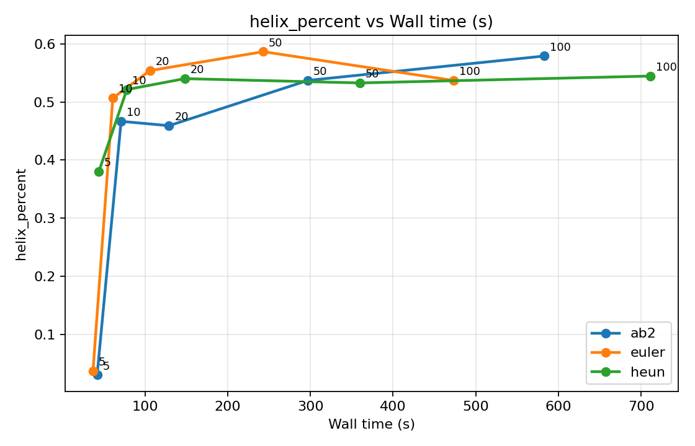
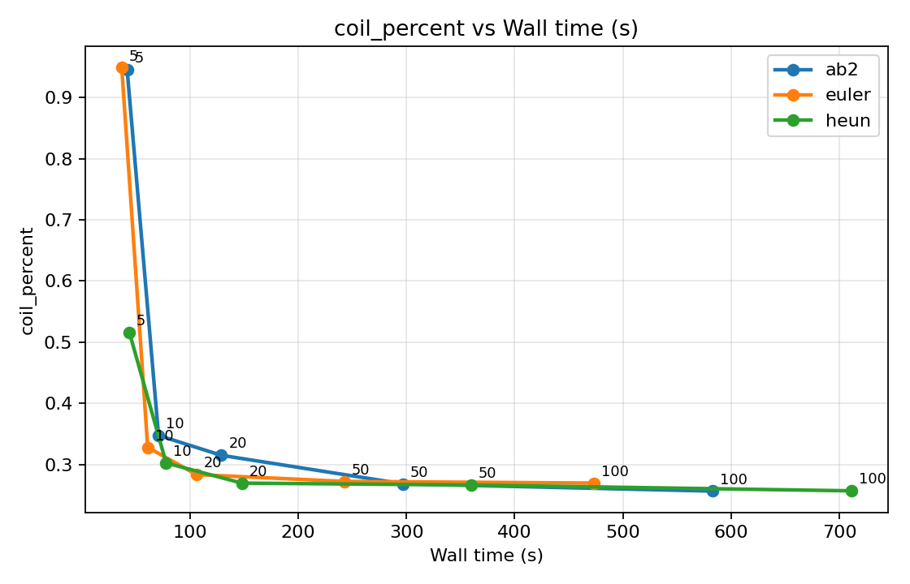

# Protein FrameFlow SE(3) Sampler Benchmark

本项目基于 FrameFlow / FoldFlow 类蛋白质骨架生成模型，目标是在不重新训练模型权重的前提下，在推理阶段替换或增强 SE(3) 流形上的采样器，从而比较一阶测地线 Euler、二阶 Heun / RK2，以及历史复用型 Lie-AB2 采样器在低步数采样下的质量和效率差异。

当前已经完成 FrameFlow 推理管线复现、Euler baseline、Heun/RK2 二阶采样器、Lie-AB2 历史复用采样器，以及 `5/10/20/50/100` 步的质量-效率 benchmark。

## 与 FrameFlow 的关系和版权说明

本仓库是基于 FrameFlow 官方代码的推理端采样器实验项目，重点是研究在不重新训练模型权重的前提下，替换 SE(3) backbone flow 的采样器。原始 FrameFlow 代码和方法归原作者所有，本仓库保留原项目的 `LICENSE` 与 `NOTICE.md`。

本项目新增或重点修改的内容包括：

- 在 `data/interpolant.py` 中加入可切换的 `euler`、`heun`、`ab2` 采样方法。
- 实现 endpoint-corrected Heun/RK2 二阶采样器。
- 实现带 SO(3) Adjoint 对齐、历史向量场复用和几何 guard 的 Lie-AB2 采样器。
- 新增 `analysis/evaluate_samples.py`，用于批量计算 CA-CA 几何、clash、半径回转和二级结构比例。
- 新增 `analysis/plot_quality_efficiency.py`，用于生成质量-效率 benchmark 汇总和折线图。
- 新增 `scripts/run_quality_efficiency_benchmark.sh`，用于批量运行 Euler / Heun / AB2 在不同步数下的采样实验。
- 新增适配 Python 3.12 / CUDA 12.4 / PyTorch 2.5.1 的 `requirements-inference.txt`。

本仓库不包含官方预训练权重、训练数据集、ProteinMPNN / ESMFold 权重，也不上传大规模生成的 PDB 样本。运行推理时需要用户按照 FrameFlow 原项目说明自行下载官方 checkpoint。

## 项目目标

- 复现 FrameFlow 官方推理流程。
- 在相同模型权重下比较不同采样步数的 Euler baseline。
- 重点观察低步数采样时的几何质量变化。
- 接入免训练的 Heun/RK2 二阶采样器，验证低步数下的几何修正效果。
- 设计 Lie-AB2 多步历史复用采样器，评估其在 SO(3) backbone frame 上的稳定性。
- 绘制质量-效率权衡曲线，为后续 ProteinMPNN / ESMFold 可设计性验证提供候选采样器。

## 当前进展

已完成无条件蛋白质骨架生成（unconditional sampling）的三类采样器实验：

- 采样器：`euler`, `heun`, `ab2`
- 采样步数：`5`, `10`, `20`, `50`, `100`
- 测试长度：`50`, `60`, `70`, `80`, `90`, `100`
- 每个长度样本数：小规模调试为 `2`，正式 benchmark 为 `20`
- 输出结构：`sample.pdb`, `bb_traj.pdb`, `x0_traj.pdb`
- 评估指标：CA-CA 几何误差、异常键长比例、半径回转、二级结构比例、运行时间与网络调用次数

核心结论：

- `5` 步极低步数下，Heun/RK2 明显优于 Euler，可显著缓解大步长带来的 CA-CA 几何退化。
- Lie-AB2 保持每步 `1` 次网络调用，但简单历史外推在 `5` 步下不稳定，当前更适合作为“历史复用多步法”的消融实验。
- 如果允许 `10` 步采样，Euler 10 已经是很强的速度-质量 baseline；Heun 的主要价值集中在 `5` 步极低步数场景。

## 环境配置

原作者 `fm.yml` 推荐环境为 Python 3.10 + PyTorch 2.0.1 + CUDA 11.7。本项目当前使用的是较新的 Python 3.12 / CUDA 12.4 / PyTorch 2.5.1 环境，因此需要使用适配版依赖文件：

```bash
pip install -r requirements-inference.txt
```

依赖文件中的关键包包括：

- `torch-scatter`
- `hydra-core`
- `omegaconf`
- `pytorch-lightning`
- `GPUtil`
- `numpy`
- `pandas`
- `scipy`
- `biopython`
- `mdtraj`
- `tmtools`
- `einops`


## 权重准备

推理需要官方预训练权重。项目默认配置指向：

```text
weights/pdb/published.ckpt
weights/pdb/config.yaml
```

如果缺少上述文件，需要从 FrameFlow 官方发布的 `weights.tar.gz` 中解压得到。

无条件采样使用配置：

```text
configs/inference_unconditional.yaml
```

其中默认 checkpoint 路径为：

```yaml
inference:
  ckpt_path: weights/pdb/published.ckpt
```

## Euler 采样命令

进入项目目录：

```bash
cd ~/protein-frame-flow-main
```

### 5 步 Euler

```bash
python -W ignore experiments/inference_se3_flows.py \
  -cn inference_unconditional \
  inference.num_gpus=1 \
  'inference.interpolant.sampling.num_timesteps=5' \
  'inference.samples.length_subset=[50,60,70,80,90,100]' \
  inference.samples.samples_per_length=2 \
  inference.inference_subdir=euler_5
```

### 20 步 Euler

```bash
python -W ignore experiments/inference_se3_flows.py \
  -cn inference_unconditional \
  inference.num_gpus=1 \
  'inference.interpolant.sampling.num_timesteps=20' \
  'inference.samples.length_subset=[50,60,70,80,90,100]' \
  inference.samples.samples_per_length=2 \
  inference.inference_subdir=euler_20
```


采样步数由下面这个 Hydra 参数控制：

```text
inference.interpolant.sampling.num_timesteps
```

对应代码位置：

```text
data/interpolant.py
```

其中 Euler 更新函数包括：

```text
_trans_euler_step
_rots_euler_step
```

## 输出目录

以 5 步 Euler 为例，输出目录为：

```text
inference_outputs/weights/pdb/published/unconditional/euler_5
```

目录结构示例：

```text
euler_5/
  length_50/
    sample_0/
      sample.pdb
      bb_traj.pdb
      x0_traj.pdb
    sample_1/
      sample.pdb
      bb_traj.pdb
      x0_traj.pdb
  length_60/
    sample_0/
    sample_1/
```

三个 PDB 文件含义：

- `sample.pdb`：最终生成的蛋白质骨架，用于主要质量评估。
- `bb_traj.pdb`：采样过程中的 backbone 轨迹，多模型 PDB，每个 `MODEL` 表示一个采样状态。
- `x0_traj.pdb`：模型在每个时间步预测的干净结构轨迹，用于观察模型预测是否稳定。

## 几何指标计算

本项目新增了批量评估脚本：

```text
analysis/evaluate_samples.py
```

它会递归查找某个输出目录下的所有 `sample.pdb`，并生成 `metrics.csv`。

### 评估 5 步结果

```bash
python analysis/evaluate_samples.py \
  --root inference_outputs/weights/pdb/published/unconditional/euler_5 \
  --out inference_outputs/weights/pdb/published/unconditional/euler_5/metrics.csv
```

### 评估 20 步结果

```bash
python analysis/evaluate_samples.py \
  --root inference_outputs/weights/pdb/published/unconditional/euler_20 \
  --out inference_outputs/weights/pdb/published/unconditional/euler_20/metrics.csv
```


主要指标包括：

- `ca_ca_deviation`：连续 CA-CA 距离与理想值 `3.802 Å` 的平均偏差，越小越好。
- `ca_ca_valid_percent`：连续 CA-CA 距离在容差内的比例，越高越好。
- `num_ca_ca_clashes`：CA 原子之间距离小于 `1.0 Å` 的数量。
- `ca_ca_min` / `ca_ca_max`：连续 CA-CA 距离的最小值和最大值。
- `ca_ca_bad_count`：连续 CA-CA 距离异常的数量。
- `radius_of_gyration`：半径回转，用于观察结构是否过度塌缩或过度展开。
- `helix_percent` / `strand_percent` / `coil_percent`：DSSP 二级结构比例。

需要注意的是，`num_ca_ca_clashes` 是 CA-only clash 指标，阈值较严格，低步数 Euler 结果中可能仍然为 0。因此后续比较二阶或多步采样器时，不应只依赖 clash 数，而应综合比较 CA-CA 偏差、异常键长、回转半径、二级结构比例以及后续 ProteinMPNN / ESMFold 可设计性验证。

## Baseline 对比方式

建议将不同步数的 `metrics.csv` 按如下维度比较：

```text
euler_5   vs euler_20 vs euler_100
```

优先观察：

- 低步数下 CA-CA 偏差是否明显增大。
- 是否出现极端 CA-CA 最小值或最大值。
- 半径回转是否异常。
- 二级结构比例是否退化。
- 采样时间是否随步数线性增加。

当前 5 步 Euler 在小规模测试中已经跑通，示例日志：

```text
Predicting DataLoader 0: 100%|...| 12/12
Finished in 6.78s
```

## 扩大样本与质量-效率曲线

为了减少小样本随机波动，建议扩大样本数后统一绘制质量-效率曲线。项目提供批量 benchmark 脚本：

```text
scripts/run_quality_efficiency_benchmark.sh
```


```bash
cd ~/protein-frame-flow-main

SAMPLES_PER_LENGTH=20 \
TIMESTEPS="5 10 20 50 100" \
LENGTH_SUBSET="[50,60,70,80,90,100]" \
bash scripts/run_quality_efficiency_benchmark.sh
```

默认会运行：

```text
euler_5_n20
euler_10_n20
euler_20_n20
euler_50_n20
euler_100_n20
heun_5_n20
heun_10_n20
heun_20_n20
heun_50_n20
heun_100_n20
ab2_5_n20
ab2_10_n20
ab2_20_n20
ab2_50_n20
ab2_100_n20
```

每个配置的样本数为：

```text
6 个长度 * 20 个样本 = 120 个骨架
3 个采样器 * 5 个步数 * 120 个骨架 = 1800 个骨架
```

脚本会为每个配置自动生成：

```text
metrics.csv
runtime_seconds.txt
```

并最终输出图表目录：

```text
inference_outputs/weights/pdb/published/unconditional/quality_efficiency_n20
```

其中包括：

```text
benchmark_summary.csv
ca_ca_deviation_vs_runtime.png
ca_ca_bad_percent_vs_runtime.png
ca_ca_valid_percent_vs_runtime.png
radius_of_gyration_vs_runtime.png
helix_percent_vs_runtime.png
coil_percent_vs_runtime.png
```

## 生成的对比图片

以下图片来自 `quality_efficiency_n20` benchmark，用于展示 Euler / Heun / AB2 在不同采样步数下的质量-效率权衡。横轴为 wall-clock runtime，图中标注数字为采样步数。

### CA-CA 几何质量


### 全局形状与二级结构






如果已经生成 metrics.csv，但缺少 runtime_seconds.txt，可以先按步数或网络调用次数画图：

```bash
python analysis/plot_quality_efficiency.py \
  --root inference_outputs/weights/pdb/published/unconditional \
  --out-dir inference_outputs/weights/pdb/published/unconditional/quality_efficiency_existing \
  --x timesteps
```

或：

```bash
python analysis/plot_quality_efficiency.py \
  --root inference_outputs/weights/pdb/published/unconditional \
  --out-dir inference_outputs/weights/pdb/published/unconditional/quality_efficiency_existing_calls \
  --x calls
```

## Heun / RK2 二阶采样器

当前已在推理端加入可切换采样器配置：

```text
inference.interpolant.sampling.method
```

可选值：

```text
euler
heun
ab2
```

默认仍为 `euler`，因此原始推理命令不受影响。Heun 采样器位于：

```text
data/interpolant.py
```

核心逻辑：

1. 在当前状态 `x_t, R_t` 前向一次模型，得到第一组预测终点。
2. 用 Euler 方式做 predictor，得到临时状态。
3. 在临时状态上再次前向模型，得到第二组预测终点。
4. 平移端不直接平均含 `1 / (1 - t)` 的第二次向量场，而是平均预测终点后使用 linear interpolant 的闭式步进，避免低步数下终点奇异性放大误差。
5. 旋转端在 SO(3) 右平凡化切空间中做 predictor-corrector，并通过指数映射回到旋转矩阵。
6. 校正项带有幅度限制，避免 5 步这类大步长下过度校正。

Heun 稳定参数：

```text
inference.interpolant.sampling.corrector_weight
inference.interpolant.sampling.max_corrector_norm_ratio
```

默认值：

```text
corrector_weight = 1.0
max_corrector_norm_ratio = 0.5
```

运行 5 步 Heun：

```bash
python -W ignore experiments/inference_se3_flows.py \
  -cn inference_unconditional \
  inference.num_gpus=1 \
  'inference.interpolant.sampling.method=heun' \
  'inference.interpolant.sampling.num_timesteps=5' \
  'inference.samples.length_subset=[50,60,70,80,90,100]' \
  inference.samples.samples_per_length=2 \
  inference.inference_subdir=heun_5_limited
```

评估 5 步 Heun：

```bash
python analysis/evaluate_samples.py \
  --root inference_outputs/weights/pdb/published/unconditional/heun_5_limited \
  --out inference_outputs/weights/pdb/published/unconditional/heun_5_limited/metrics.csv
```


注意：当前代码中的 `num_timesteps=5` 表示 5 个时间网格点，即 4 个积分区间和 1 次最终预测。Euler 约为 5 次网络调用，Heun 约为 `2 * 4 + 1 = 9` 次网络调用。

## Lie-AB2 历史复用采样器

为了验证“压榨历史预测数据”的多步法思路，项目实现了 Adams-Bashforth 2 阶风格的 Lie-AB2 采样器：

```text
inference.interpolant.sampling.method=ab2
```

AB2 的核心动机是避免 Heun 每个积分区间额外前向一次模型，而是复用上一时间步已经计算过的向量场：

1. 当前步正常前向一次模型，得到当前平移速度与 SO(3) 旋转向量场。
2. 从历史缓存中取出上一时间步的向量场。
3. 对旋转向量场使用 SO(3) Adjoint 对齐，将历史角速度迁移到当前 frame 的切空间。
4. 在同一切空间内做 AB2 组合。
5. 最后通过平移更新和 SO(3) 指数映射回到 backbone frame。

当前实现额外加入了保守稳定化策略：

- `multistep_trans_weight`：平移端多步修正权重，当前默认 `0.0`。
- `multistep_rot_weight`：旋转端多步修正权重，当前默认 `0.5`。
- `max_multistep_correction_ratio`：限制 AB2 修正项幅度。
- `ab2_geometry_guard`：如果 AB2 候选结构的 CA-CA 几何比 Euler 候选更差，则单样本回退到 Euler。

运行 5 步 AB2：

```bash
python -W ignore experiments/inference_se3_flows.py \
  -cn inference_unconditional \
  inference.num_gpus=1 \
  'inference.interpolant.sampling.method=ab2' \
  'inference.interpolant.sampling.num_timesteps=5' \
  'inference.samples.length_subset=[50,60,70,80,90,100]' \
  inference.samples.samples_per_length=2 \
  inference.inference_subdir=ab2_5
```

当前实验结论是负结果但有研究价值：在 `5` 步极低步数下，简单 AB2 历史外推不适合直接用于 FrameFlow 的 SO(3) backbone frame，容易出现系统性 CA-CA 压缩；相比之下，Heun 这种二次前向校正更可靠。因此当前主方法应以 Heun/RK2 为主，AB2 作为多步历史复用方向的消融和后续改进基础。

## Benchmark 结果

正式 benchmark 使用 `6` 个长度、每长度 `20` 个样本，每个配置共 `120` 个骨架。结果文件位于：

```text
protein-frame-flow-main/inference_outputs/weights/pdb/published/unconditional/quality_efficiency_n20/benchmark_summary.csv
```

关键结果如下：

| method | steps | calls | runtime_s | sec/sample | ca_dev | ca_bad | ca_valid | ca_mean |
| --- | ---: | ---: | ---: | ---: | ---: | ---: | ---: | ---: |
| euler | 5 | 5 | 37 | 0.3083 | 0.4891 | 0.7538 | 0.9499 | 3.3437 |
| heun | 5 | 9 | 44 | 0.3667 | 0.0744 | 0.0499 | 0.8903 | 3.7968 |
| ab2 | 5 | 5 | 42 | 0.3500 | 0.5755 | 0.8042 | 0.9704 | 3.2470 |
| euler | 10 | 10 | 61 | 0.5083 | 0.0389 | 0.0010 | 0.9747 | 3.8240 |
| heun | 10 | 19 | 78 | 0.6500 | 0.0403 | 0.0008 | 0.9706 | 3.8259 |
| ab2 | 10 | 10 | 71 | 0.5917 | 0.0384 | 0.0004 | 0.9724 | 3.8203 |
| euler | 20 | 20 | 106 | 0.8833 | 0.0359 | 0.0004 | 0.9807 | 3.8217 |
| heun | 20 | 39 | 148 | 1.2333 | 0.0382 | 0.0000 | 0.9735 | 3.8256 |
| ab2 | 20 | 20 | 129 | 1.0750 | 0.0370 | 0.0005 | 0.9766 | 3.8240 |
| euler | 50 | 50 | 243 | 2.0250 | 0.0315 | 0.0002 | 0.9912 | 3.8227 |
| heun | 50 | 99 | 360 | 3.0000 | 0.0370 | 0.0004 | 0.9854 | 3.8270 |
| ab2 | 50 | 50 | 297 | 2.4750 | 0.0315 | 0.0000 | 0.9906 | 3.8226 |
| euler | 100 | 100 | 473 | 3.9417 | 0.0301 | 0.0001 | 0.9939 | 3.8200 |
| heun | 100 | 199 | 711 | 5.9250 | 0.0313 | 0.0003 | 0.9923 | 3.8220 |
| ab2 | 100 | 100 | 583 | 4.8583 | 0.0304 | 0.0000 | 0.9921 | 3.8224 |

从质量-效率角度看：

- `5` 步极低步数：Heun 是最有效的几何修正方法，CA-CA 偏差从 Euler 的 `0.4891` 降到 `0.0744`。
- `10` 步及以上：Euler 已经恢复到较稳定的几何范围，是更强的 practical baseline。
- AB2 的 `10` 步结果接近 Euler，但 `5` 步明显失败，说明简单历史外推在极低步数下还不足以替代二次前向校正。

## 后续计划

下一阶段将继续基于当前 Euler baseline、Heun sampler 和 AB2 消融结果推进：

1. 将 endpoint-corrected Heun 作为当前主采样器，在更多长度和随机种子下复测。
2. 增加更敏感的 backbone heavy-atom clash 指标，避免只看 CA-only clash。
3. 接入 ProteinMPNN 进行序列设计。
4. 使用 ESMFold 对设计序列回测结构，评估生成骨架的可设计性。
5. 继续探索更稳健的 Lie group multistep / DPM-Solver 风格方法，例如更合理的向量场 transport、时间参数化和误差控制。

## 当前推荐结论

当前阶段可以在报告或论文草稿中使用如下结论：

```text
Heun/RK2 在 5-step 极低步数采样下显著改善 Euler 的几何退化，是当前最有效的低步数修正方法。Lie-AB2 虽然保持 1 NFE/step，但简单历史向量场外推在 FrameFlow 的 SO(3) backbone frame 上不稳定，5-step 下出现系统性 CA-CA 压缩。因此，当前阶段应将 endpoint-corrected Heun 作为主方法，AB2 作为历史复用多步法的消融实验。
```


## 致谢

本项目基于 FrameFlow 官方代码与预训练权重进行推理端采样器实验。原始 FrameFlow 方法来自 SE(3) flow matching 在蛋白质骨架生成与 motif scaffolding 上的工作。
